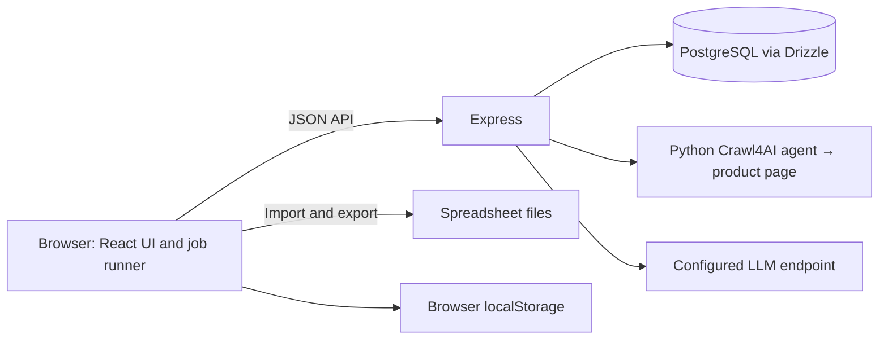

# Paxth Q.A. Engine

An internal ecommerce catalog review application, displayed in the UI as **Project 22**. Import product spreadsheets, collect SAP and product-page evidence, run an OpenAI-compatible language model against category rules, and download Excel files for human review.

The application uses React, TypeScript, Express, PostgreSQL/Drizzle, and a Python Crawl4AI agent. It has working QA and export checks, but several reliability and access-control limitations remain. Read the [codebase analysis](docs/codebase-analysis.md) for evidence and priorities, and the [two Codex task briefs](docs/codex-tasks.md) for follow-up work.

## Does pushing to GitHub update the live app?

**No, not by itself.** Tailscale Funnel routes public HTTPS traffic to a service on your server; it does not pull Git commits or rebuild the application. No automatic deployment workflow is checked into this repository. Any separate automation on the VPS has not been inspected. See the [Tailscale Funnel documentation](https://tailscale.com/docs/features/tailscale-funnel).

The existing VPS deployment at `/opt/paxth-qa` contains copied source, **not a Git checkout**. Push the tested branch, transfer source from its exact commit (excluding secrets, backups, dependencies, and build artifacts), and build a release image before replacing the running app. Preserve the host's `.env`, `compose.yaml`, and gateway files. After retaining the previous image and tagging the tested release as `paxth-qa:local`, run **on the VPS**:

```bash
cd /opt/paxth-qa
docker compose up -d --no-build --no-deps app
docker compose logs --tail=50 app
```

Back up the database and retain the previous source and image before deployment as described in [deployment and updates](#deployment-and-updates). Record the deployed commit on the VPS. A container restart alone does not rebuild changed source. Leave the existing Funnel listener in place. Automatic deployment is proposed in [Task 2](docs/codex-tasks.md#task-2--prioritized-improvements-roadmap); it is not implemented.

## What the application does

1. **Dashboard:** import the first sheet of an `.xlsx`, `.xls`, or `.csv` file, inspect/filter SKUs, scrape selected URLs, supply source content, and create jobs.
2. **Scraper:** test a URL and maintain shared domain-specific CSS selectors, including optional dynamic-tab capture.
3. **Attribute Sets:** save category names and Markdown mapping rules in PostgreSQL.
4. **LLM Settings:** configure a provider, model, API key, execution settings, and shared QA agent memory.
5. **Jobs:** run selected jobs, inspect results, rerun SKUs, and export detailed Excel feedback.
6. **Users:** manage browser-local accounts. These accounts are not server-enforced authorization.

SAP text is supplied through uploads or the editor; there is no direct SAP/ERP integration. SAP is the primary factual source. Web evidence supports details absent from SAP, and conflicts must be reported. The model is instructed to avoid invented facts and supply complete replacement cell values when supported. Human review remains necessary: structural validation cannot prove every model conclusion correct.

## Architecture and storage



Express mounts Vite middleware in development. With `NODE_ENV=production`, it serves `dist/public` and the same API routes. The server entrypoint is `dist/server.mjs`; it is outside the public asset directory.

| Data | Where it lives | Consequence |
| --- | --- | --- |
| Catalog rows, source text, scraped Markdown, latest QA results | PostgreSQL `sku_data` | Shared by clients using the same database |
| Job membership, status, token/time totals | PostgreSQL `jobs` | Saved records persist, but execution is browser-driven |
| Category rules and QA agent memory | `attribute_sets`, `qa_agent_settings` | Shared; a configuration snapshot is loaded at each run |
| Domain selectors | PostgreSQL `site_selectors`, with a browser cache | Scraping uses server-loaded rules; a failed UI load can show stale cached rules |
| Provider URL, API key, model, execution settings | Browser `localStorage` | Specific to the browser and origin, including port; the key is sent to the Express proxy for requests |
| Login session and user accounts/passwords | Browser `localStorage` | Not synchronized accounts or an API security boundary; passwords are stored as plaintext |
| Notifications and active run controls | React memory | Lost on reload; run controls also reset when the Jobs component unmounts |

The schema defines a `users` table, but the current login does not use it. The API has no application authentication middleware. For the documented public deployment, the Caddy authentication gateway is the access barrier; keep the backend bound to loopback through Compose.

## Local setup

Use **Node.js 22**, **Python 3.11+**, npm, and an accessible PostgreSQL database. The Dockerfile and devcontainer use Node 22 with Debian's Python 3.11. Linux scraping also needs Chromium system libraries; the Dockerfile lists the installed packages.

```bash
npm ci
# Create the file only if it does not already exist.
test -e .env || cp .env.example .env
```

Edit `.env` and set `DATABASE_URL` to the intended database. Create that database with your PostgreSQL service first; Compose does not provision PostgreSQL. For Supabase, use the exact TLS-enabled connection URI from the project's Connect dialog. In an IPv4-only environment, use its Session pooler connection details rather than guessing the hostname or region.

For a **new, empty application database**, review and apply the declared schema:

```bash
npm run db:push
```

Do not blindly run `db:push` on an existing/shared production database: inspect the proposed changes and take a backup. Startup initializes shared QA configuration, jobs, and selectors and attempts some schema alterations, but **does not create the base `sku_data` table**. There is no checked-in versioned migration history.

Install the pinned Crawl4AI dependencies and its browser before scraping:

```bash
python3.11 -m venv .venv
.venv/bin/python -m pip install -r scraper/requirements.txt
.venv/bin/python -m playwright install chromium
npm run dev
```

The app detects `.venv/bin/python` automatically. Set `CRAWL4AI_PYTHON` in `.env` only to use a different interpreter. In the devcontainer, you can instead install into its existing `/opt/crawl4ai` virtualenv using `$CRAWL4AI_PYTHON -m pip install -r scraper/requirements.txt` and `$CRAWL4AI_PYTHON -m playwright install chromium`. On a Linux host missing browser libraries, run `.venv/bin/python -m playwright install-deps chromium` with the required system privileges.

Open [localhost:3000](http://localhost:3000). The production image installs Crawl4AI and Chromium and verifies the browser launches as `node`. The devcontainer uses the Dockerfile's `system` stage and requires the Python dependency/browser installation above. Keep a Codespaces port private because the application's login does not protect its API. The existing UI browser tests still use CloakBrowser; install it separately with `npx --no-install cloakbrowser install` before running them.

| Configuration | Current use |
| --- | --- |
| `DATABASE_URL` | PostgreSQL connection; loaded from `.env` or the process environment |
| `PORT` | Express port, default `3000` |
| `NODE_ENV=production` | Serve built frontend assets instead of Vite middleware |
| `DISABLE_HMR=true` | Disable development HMR/file watching through Vite configuration |
| `CRAWL4AI_PYTHON` | Python 3.11+ interpreter; defaults to `.venv/bin/python` when present, then `python3`. Docker sets `/opt/crawl4ai/bin/python`. |
| `CLOAKBROWSER_AUTO_UPDATE=false` | Used by the existing UI browser tests to disable automatic browser updates |
| `GEMINI_API_KEY` | Present in the example file but unused by the current application; configure the LLM through the UI |

For a production build outside Docker:

```bash
npm run build
NODE_ENV=production npm start
```

`npm start` alone does not set production mode. `npm run preview` serves the Vite frontend preview, not the Express API. The optional Linux helper `./start.sh` stops this checkout's existing listeners on ports 3000 and 24678, then starts development.

## Importing and reviewing a catalog

### Input columns

The first worksheet and its first header row are used. There is no interactive column-mapping step.

| Column | Meaning |
| --- | --- |
| `sku` or `SKU` | Product identifier; required for the row to be imported |
| `attributes__<field>` | Upload attributes being checked; the prefix is stripped in `upload_attributes`, while the original row is retained |
| `source__sap` or a case-insensitive `sap` header | Supplied SAP source text |
| `source__url` or a case-insensitive `url` header | Product-page URL |
| Case-insensitive `attribute_set` or `attribute set` | Category name used to group a job and find its mapping rules |
| Other columns, such as `name`, `base_code`, `note` | Retained in the original row and included in QA unless they are source/QA metadata |

Keep identifiers such as SKUs and barcodes as text in spreadsheets to avoid numeric conversion. Rows without a usable SKU are skipped. Within a file, the first occurrence of a trimmed SKU is kept. The UI skips SKUs already in the loaded catalog; uploading a duplicate is not an edit operation. Category grouping currently requires identical, nonblank names, including case and spacing, even though rule lookup trims names and ignores case.

### Prepare evidence and create a job

1. Configure and save **LLM Settings**. Scraping and QA both require a nonempty API key, base URL, and model, including when using a compatible local endpoint. The endpoint must be reachable from the application server.
2. Add mapping rules in **Attribute Sets**, matching the spreadsheet category. Seeded category names initially have blank rules.
3. Upload the spreadsheet and select SKUs. A URL makes a row initially `ready`, but job creation still requires SAP text or actual scraped/pasted content.
4. Use **Scrape Selected** for URL evidence. Failed scrapes can enter the manual-content queue. **Edit SAP** is available when a SKU has no nonblank scraped content; saving it preserves the uploaded row and previous QA result.
5. Create one job from SKUs sharing one nonblank attribute set. Open **Jobs** and run it.

Every **Scrape URL**, **Scrape Selected**, and automatic job scrape uses a Crawl4AI browser agent with the saved QA endpoint, API key, and model. The agent inspects the supplied product page, loads lazy content, and opens product tabs/accordions for the current variant. It does not crawl the whole site, change variants, log in, submit forms, or solve CAPTCHAs. Blocked pages, unusable content, and failed runs keep the existing SAP/manual-content fallback; no scraper can guarantee success on every URL.

The most specific enabled matching domain rule still controls CSS extraction. Dynamic tabs need both control and panel selectors; their wait defaults to 300 ms and supports 0–10,000 ms. Configured tabs are captured separately from the agent's eight-decision limit. Selectors that match nothing fail visibly. Product evidence is converted from captured HTML into Markdown, preserving specification labels and tables; the LLM chooses browser actions instead of rewriting source facts. Saved content and subsequent QA/export behavior remain the same, including the existing 40,000-character default QA evidence limit and truncation warning.

Express starts the Python SDK worker as a subprocess; its JSON stdin/stdout protocol is internal and exposes no additional service or port. Scrapes run one at a time, with a FIFO queue of up to eight waiting requests. A queued request waits at most 120 seconds; execution has a separate 120-second limit and at most eight agent decisions. Requests fail visibly when limits are reached, and worker/browser cleanup runs on completion, failure, or client disconnect. Each scrape makes LLM calls and incurs provider cost; those calls are separate from existing QA token totals.

Keep the browser open and stay in the Jobs view until the run finishes. Selected jobs run sequentially, but **SKUs within a job use configurable concurrency**, defaulting to 2. “Stop After Current SKU” is cooperative; it does not abort an outstanding server request. Reloading/closing the page interrupts browser orchestration, and navigating between modules can lose run controls while work continues. There is no durable backend worker or cross-client job lock.

### QA settings and results

The current defaults are 3 client retries, 4,096 output tokens, temperature 0.1, and 40,000 characters of web evidence. The chat proxy has its own retry logic, so provider attempts can exceed the client retry setting. Set a model/base URL your provider supports; the shipped default is not an availability guarantee.

AICredits uses `https://api.aicredits.in/v1`; saved website-host URLs are migrated to this API hostname without changing the selected model or execution settings. **Test API** runs a small sample QA task with the editor's model, temperature, output-token limit, and QA memory. It reports success only after validating the QA response. Empty answers and exhausted output budgets fail visibly, including reasoning-token usage when the provider supplies it. Save Changes applies the tested settings to jobs.

All requests use the OpenAI-compatible chat-completions format. The Provider Format dropdown currently also lists Anthropic and Gemini, but selecting them does not implement their native API protocols. Use a compatible endpoint; the dropdown does not change the request format.

Each run fetches shared memory and category rules before processing. Unavailable shared configuration prevents the run from starting. Missing, blank, or ambiguous rules produce a general review with a warning; truncated web content also produces a warning. A SKU with no usable SAP or web evidence fails. The same prepared evidence is retained through that SKU's retries.

The application validates the returned JSON structure and reconciles issue counts, severity colors, and status. `data_mismatch` requires both source truth and a complete suggested replacement. These checks validate the response contract, not the truth of the source claim.

| QA finding | Color | Result behavior |
| --- | --- | --- |
| Critical | Red | QA fails |
| Moderate | Orange | At least a warning |
| Minor | Yellow | At least a warning |
| Missing category rules or truncated evidence | Orange | Cannot pass without a warning |

Catalog processing status (`ready`, `running`, `completed`, `failed`, etc.) differs from the review verdict (`pass`, `warning`, `fail`). A job can finish processing successfully while individual SKUs have a failing QA verdict. Jobs reference the catalog's current results; they are not immutable historical result snapshots.

### Exporting

Use **Jobs** exports for detailed review. Single-job, selected completed-job, and issues-only exports preserve original columns and add `Corrected: <original header>` beside affected `attributes__` columns. Cells have severity highlighting and notes with explanations, source truth, and suggestions. Conflicting or absent suggestions leave correction cells blank for review. General/unmatched findings are attached to `qa_status`; `qa_scrape_status` and `job_error` are appended.

Combined jobs must use one attribute set and compatible original header order. Issues-only export includes warning/fail verdicts. Legacy uploads without stored header order can be exported with a warning. The Dashboard's Excel download is a separate summary; its missing/mapping counts currently use outdated issue types. A JSON-download function remains in source but has no UI control. Existing results can be exported without a new LLM call.

### Writing mapping rules

Paste category-specific Markdown into **Attribute Sets** and save. The root-level [TV](tv_mapping_rules.md), [USB hub](usb_hubs_mapping_rules.md), and [charger/cable](power_adapters_chargers_utility_cables_mapping_rules.md) documents are reference material; they are not automatically imported.

Use this prompt when drafting rules, then review the result before saving:

```text
Write Markdown QA mapping rules for [CATEGORY] and these exact uploaded
column names: [ATTRIBUTES]. For each attribute, state required/optional
status, accepted formats and units, missing-data handling, and severity.
Use supplied SAP as primary evidence and product-page content as secondary
evidence. Report source conflicts. Do not invent product facts or infer
shipping weight from product weight, or colour from material. Preserve
identifiers and the cell's language. Request complete replacement cell
values only where evidence or a formatting rule supports the correction;
otherwise explain what must be verified and leave the correction blank.
```

**QA Agent Memory** supplies shared standing instructions. Category rules take precedence for category-specific checks; the application's output/evidence requirements take precedence over both. “Restore Default Memory” changes the editor until saved. Blank saved memory uses the default. Changes affect new runs/reruns, not an already running configuration snapshot or existing results. “Import browser rules” imports only missing/blank shared rules without overwriting nonblank ones. Previous browser memory can be loaded into the editor for review before saving.

## API and developer checks

All routes below are registered in [server.ts](server.ts) or [shared QA configuration routes](src/db/qaConfiguration.ts). They have no application authentication; public deployment requires the gateway.

| Routes | Methods | Purpose |
| --- | --- | --- |
| `/api/db-status` | GET | Database connectivity (`SELECT 1`), not complete schema readiness |
| `/api/catalog`, `/api/catalog/:sku` | GET/POST/DELETE collection; PUT item | Load/upsert/delete catalog data; update one SKU |
| `/api/jobs`, `/api/jobs/:id` | GET/POST/DELETE collection; PUT/DELETE item | Persist job records; does not run a server-side queue |
| `/api/qa-configuration` | GET | Shared memory and attribute sets in one snapshot |
| `/api/qa-agent-memory` | PUT | Save shared memory |
| `/api/attribute-sets`, `/api/attribute-sets/:id`, `/api/attribute-sets/import` | POST collection/import; PUT/DELETE item | Maintain shared category rules |
| `/api/site-selectors`, `/api/site-selectors/:id` | GET/POST collection; PUT/DELETE item | Maintain extraction rules |
| `/api/scrape` | POST | `{ url, llm: { baseUrl, apiKey, modelName } }` → `{ markdown }`; failures use `{ error, details }` |
| `/api/chat` | POST | Proxy `{ baseUrl, apiKey, payload }` to chat completions |

Run the checks that do not require a browser or database:

```bash
npm run lint
npm run test:job-state
npm run test:site-selector
npm run test:blocked-page
npm run test:db-error
npm run test:lazy-content
npm run test:llm-response
npm run test:qa-agent
npm run test:scrape-agent
```

`lint` is TypeScript checking, not ESLint. Additional checks have prerequisites:

```bash
# Requires an installed CloakBrowser binary and its OS libraries.
npm run test:tab-capture
npm run test:sap-editor

# Requires the Crawl4AI virtualenv and Chromium installed above.
CRAWL4AI_PYTHON="$PWD/.venv/bin/python" npm run test:crawl-worker

# Set TEST_DATABASE_URL to a disposable test database before running.
npm run test:qa-config-db
```

The Crawl4AI checks passed locally with Python 3.11, Crawl4AI 0.9.3, and Playwright 1.58 (the workspace runs Debian 11). Checks covered real browser fixtures, all three UI entry points, process cleanup, and a production API scrape of a public page using a mocked LLM response. Deployment additionally requires the Docker browser and worker smoke checks below. A live LLM-provider run requires the user's saved provider settings.

The database test creates and drops an isolated schema. Never point it at the shared production database. The SAP editor browser test mocks API traffic; it does not prove real database persistence. Check the [analysis validation record](docs/codebase-analysis.md#validation-record) for what was actually run.

## Deployment and updates

### Existing VPS topology

The VPS, container, and Funnel routes were inspected on 2026-09-17:

```text
https://project22.tail608e42.ts.net/
    → dedicated tailscaled-project22.service (HTTPS :443)
    → Caddy 127.0.0.1:8082 (HTTP Basic authentication)
    → Docker-published 127.0.0.1:3200
    → Express container :3000
```

The deployment directory is `/opt/paxth-qa`. Its gateway requires separately supplied credentials; a Tailscale client is not required. The separate Rakazo application uses `https://rakazo.tail608e42.ts.net/`, its own containers, and the default Tailscale service. Do not change those resources. A legacy Rakazo-hostname listener on port 8443 also points to the QA gateway; leave that existing route unchanged.

[compose.yaml](compose.yaml) defines the separate `paxth-qa` project, image `paxth-qa:local`, restart policy, loopback port binding, 1 CPU, 1,536 MiB memory, 256 MiB shared memory, and rotating container logs. The image runs as `node`, installs pinned Crawl4AI and Chromium, checks the browser launch, and serves the production build. Secrets, virtualenvs, Python caches, and backups are excluded from the image build. On the Docker-capable deployment host, also run `/opt/crawl4ai/bin/python scraper/worker_test.py` inside the candidate image before promotion, with no production environment file attached.

Keep `/opt/paxth-qa/.env` readable only by its owner (`chmod 600 .env`). Its `DATABASE_URL` must reach PostgreSQL from inside the container: container `localhost` is not the VPS host. Caddy should authenticate every page, asset, and API request, strip inbound `Authorization` before proxying, store only the password hash, and accept the Funnel hostname. This repository does not contain its Caddyfile.

Inspect Project 22's existing listener using its dedicated socket:

```bash
tailscale --socket=/run/tailscale-project22/tailscaled.sock funnel status
```

Do not rerun gateway setup for an ordinary code update. Before deploying, wait for active browser-driven jobs to finish, confirm the tested source commit, retain the previous source and image, and make a database backup using the database provider or PostgreSQL tools. Store it outside the source directory and verify it can be restored. Startup executes DDL, so a successful code build is not a database migration check. Build and smoke-test the release image before changing the running container.

For an existing deployment, retain the current image before the update commands near the top of this document:

```bash
docker image tag paxth-qa:local paxth-qa:previous
```

After rebuilding, verify:

```bash
docker compose ps
docker compose logs --tail=50 app
curl -fsS http://127.0.0.1:3200/api/db-status
tailscale --socket=/run/tailscale-project22/tailscaled.sock funnel status
```

Also load the catalog and shared configuration, since database connectivity alone does not prove schema readiness. From outside the tailnet, check that missing/wrong gateway credentials return `401` for the page, an asset, and an API route. With valid credentials, run `scripts/verify-public-access.mjs` against the Project 22 URL and verify login, SAP editing, a sample scrape, and persistence after a controlled app restart. Confirm Rakazo's container IDs and start times are unchanged and ports 3200/8082 remain loopback-only.

### Rollback and private access

If the newly built image fails and the old image is compatible with the current schema, restore the retained image:

```bash
cd /opt/paxth-qa
docker image tag paxth-qa:previous paxth-qa:local
docker compose up -d --no-build --force-recreate app
docker compose logs --tail=50 app
```

This rolls back the image only. Do not run `--build` until the checkout is back on the intended release. Changes to Compose, environment configuration, or the database require their own reviewed rollback; never restore a shared database automatically over newer data.

To switch this listener to private, tailnet-only access, configure its port with Serve. The most recent Serve/Funnel command determines that port's exposure, as described in the [Tailscale documentation](https://tailscale.com/docs/features/tailscale-funnel):

```bash
tailscale --socket=/run/tailscale-project22/tailscaled.sock serve --bg --https=443 http://127.0.0.1:8082
```

To remove this deployment, disable only its listener using the original flags, then stop only its Compose project. The target URL can be omitted when turning a listener off; see the [Funnel CLI reference](https://tailscale.com/docs/reference/tailscale-cli/funnel):

```bash
tailscale --socket=/run/tailscale-project22/tailscaled.sock funnel --bg --https=443 off
cd /opt/paxth-qa
docker compose down
```

The earlier deployment notes name `/opt/paxth-qa/backups/Caddyfile.before` as a gateway backup. Before restoring it, compare it with the current shared Caddy configuration and validate it with `caddy validate --config /opt/paxth-qa/backups/Caddyfile.before --adapter caddyfile`. Restore/reload only after confirming it preserves other services. Avoid `tailscale serve reset`, which would remove unrelated settings. Stopping this Compose project does not delete the external PostgreSQL database.

## Troubleshooting and current limits

| Symptom | Check |
| --- | --- |
| GitHub has new code but the public URL looks unchanged | Update/rebuild on the VPS; restarting the old container is insufficient. Refresh the browser after deployment. |
| “Database connected” but the catalog fails | `/api/db-status` only runs `SELECT 1`; inspect schema initialization logs and verify the base schema exists. |
| Settings/rules will not save | Shared configuration requires PostgreSQL. Settings save also persists shared memory before local provider settings. |
| Scrape fails or shows a challenge | Test the URL/selectors in Scraper; use SAP or manually supplied product content when needed. Check browser installation and container logs. |
| Reload loses a running job's controls | Execution lives in the browser. Inspect saved SKU results before resuming; avoid running the same job in multiple tabs. |
| An upload appears to do nothing | Empty/malformed/no-SKU upload errors are not currently rendered; inspect the browser console and input headers. |
| A save/delete looks successful but returns after reload | Several mutation paths ignore failed HTTP responses. Reload to verify persistence; see findings F03/F04 in the analysis. |
| Combined export is rejected | Use one identical category name and compatible original header order across all included SKUs. |
| LLM settings disappear at a different URL | Provider settings and keys belong to that browser origin, including its port. |

The analysis also identifies vulnerable dependencies, unbounded server work, and missing URL restrictions. Treat these as concrete follow-up work before expanding access. This documentation change does not fix them or certify the live deployment.
