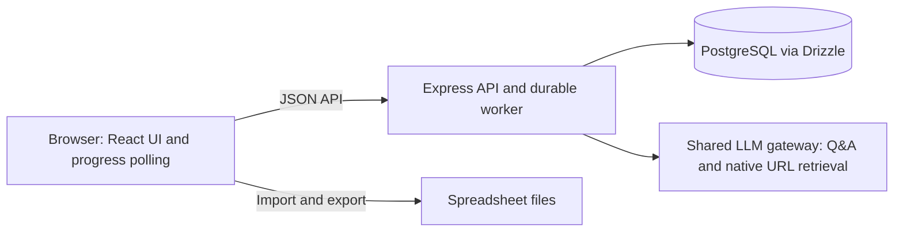

# Paxth Q.A. Engine

An internal ecommerce catalog review application, displayed in the UI as **Project 22**. Import product spreadsheets, collect SAP and product-page evidence, run an OpenAI-compatible language model against category rules, and download Excel files for human review.

The application uses React, TypeScript, Express, PostgreSQL/Drizzle, and provider-side URL retrieval. See [security and durable jobs](docs/security-and-jobs.md) for the current authentication, execution limits, and validation record.

## Does pushing to GitHub update the live app?

**No, not by itself.** Tailscale Funnel routes public HTTPS traffic to a service on your server; it does not pull Git commits or rebuild the application. No automatic deployment workflow is checked into this repository. Any separate automation on the VPS has not been inspected. See the [Tailscale Funnel documentation](https://tailscale.com/docs/features/tailscale-funnel).

The existing VPS deployment at `/opt/paxth-qa` contains copied source, **not a Git checkout**. Push the tested branch, transfer source from its exact commit (excluding secrets, backups, dependencies, and build artifacts), and build a release image before replacing the running app. Preserve the host's `.env`, `compose.yaml`, and gateway files. After retaining the previous image and tagging the tested release as `paxth-qa:local`, run **on the VPS**:

```bash
cd /opt/paxth-qa
docker compose up -d --no-build --no-deps app
docker compose logs --tail=50 app
```

Back up the database and retain the previous source and image before deployment as described in [deployment and updates](#deployment-and-updates). Record the deployed commit on the VPS. A container restart alone does not rebuild changed source. Leave the existing Funnel listener in place. Automatic deployment is not implemented.

## What the application does

1. **Dashboard:** import the first sheet of an `.xlsx`, `.xls`, or `.csv` file, inspect/filter SKUs, scrape selected URLs, supply source content, and create jobs.
2. **Scrapper agent:** retrieve a public URL through the configured browsing model and preview its Markdown.
3. **Attribute Sets:** save category names and Markdown mapping rules in PostgreSQL.
4. **LLM Settings:** administrators edit separate Q&A and Scrapper models, output limits, and shared QA instructions; both models use the server provider credentials.
5. **Jobs:** run selected jobs, inspect results, rerun SKUs, and export detailed Excel feedback.
6. **Users:** administrators manage shared server-authenticated accounts and roles.

SAP text is supplied through uploads or the editor; there is no direct SAP/ERP integration. SAP is the primary factual source. Web evidence supports details absent from SAP, and conflicts must be reported. The model is instructed to avoid invented facts and supply complete replacement cell values when supported. Human review remains necessary: structural validation cannot prove every model conclusion correct.

## Architecture and storage


```mermaid
flowchart LR
    B[Browser: React UI and progress polling] -->|JSON API| E[Express API and durable worker]
    B -->|Import and export| X[Spreadsheet files]
    E --> D[(PostgreSQL via Drizzle)]
    E --> M[Shared LLM gateway: Q&A and native URL retrieval]
```

Express mounts Vite middleware in development. With `NODE_ENV=production`, it serves `dist/public` and the same API routes. The server entrypoint is `dist/server.mjs`; it is outside the public asset directory.

| Data | Where it lives | Consequence |
| --- | --- | --- |
| Catalog rows, source text, scraped Markdown, latest QA results | PostgreSQL `sku_data` | Shared by clients using the same database |
| Job membership, status, token/time totals | PostgreSQL `jobs` | Runs and per-SKU results persist in `job_runs`/`job_run_items`; execution survives tab closure |
| Category rules and QA agent memory | `attribute_sets`, `qa_agent_settings` | Shared; a configuration snapshot is loaded at each run |
| Legacy domain selectors | Existing PostgreSQL `site_selectors` data | Retained untouched; no runtime routes or dependencies |
| Provider URL/API key; model/settings | Server environment; PostgreSQL `provider_settings` | Shared, admin-configured; secrets never reach browsers |
| Accounts and sessions | PostgreSQL `users`/`sessions` | Scrypt password hashes, hashed session tokens, eight-hour HttpOnly cookies, server role enforcement |
| Notifications; run controls | React memory; server run state | Notifications reset on reload; job controls reconnect by polling |

Every protected API checks the server session and permissions. Keep the Caddy authentication gateway and Compose loopback binding as additional barriers. Run `npm run admin:bootstrap` to create the first administrator (defaults: `Aswath` / `potusdown@2230`). Existing accounts are not overwritten. See [security setup and recovery](docs/security-and-jobs.md).

## Local setup

Use **Node.js 22**, npm, and an accessible PostgreSQL database. Retrieval runs at the provider; Python and a local browser are not required by the application.

```bash
npm ci
# Create the file only if it does not already exist.
test -e .env || cp .env.example .env
```

Edit `.env` and set `DATABASE_URL` to the intended database. Create that database with your PostgreSQL service first; Compose does not provision PostgreSQL. For Supabase, use the exact TLS-enabled connection URI from the project's Connect dialog. In an IPv4-only environment, use its Session pooler connection details rather than guessing the hostname or region.

Startup creates the application schema and verifies required constraints before serving requests or starting the worker. It stops on migration errors. Existing selector rows are neither inspected nor modified. Before upgrading existing data, back up and test against a restored copy; do not run `db:push` blindly. Configure `APP_ORIGIN`, `LLM_BASE_URL`, and `LLM_API_KEY`, then create the first administrator with `npm run admin:bootstrap` using the environment variables described in [security setup](docs/security-and-jobs.md). Use a direct PostgreSQL connection or session pooler; the worker requires a session-scoped advisory lock.

Start the application:

```bash
./start.sh
```

Open [localhost:3000](http://localhost:3000). Codespaces forwards port 3000 and opens its frontend URL automatically when the port is forwarded; the launcher also prints the URL. The frontend, API, and Vite live reload share this port. The production image runs the Node application as `node`. UI tests use the existing development-only CloakBrowser/Playwright dependencies: install their browser with `npx --no-install cloakbrowser install`, or set `CHROMIUM_EXECUTABLE` to an installed Chromium binary. Install browser OS libraries only on the test host when needed.

| Configuration | Current use |
| --- | --- |
| `DATABASE_URL` | PostgreSQL connection; loaded from `.env` or the process environment |
| `LLM_BASE_URL`, `LLM_API_KEY` | Complete server-only provider override; configure both together. With neither set, existing `AICREDITS_API_KEY` uses `https://api.aicredits.in/v1`. Retrieval requires native search, URL filters and citations |
| `PORT` | Express port, default `3000` |
| `NODE_ENV=production` | Serve built frontend assets instead of Vite middleware |
| `DISABLE_HMR=true` | Disable development HMR/file watching through Vite configuration |
| `CLOAKBROWSER_AUTO_UPDATE=false` | Used by the existing UI browser tests to disable automatic browser updates |

For a production build outside Docker:

```bash
npm run build
NODE_ENV=production npm start
```

`npm start` alone does not set production mode. `npm run preview` serves the Vite frontend preview, not the Express API. The Linux launcher `./start.sh` requires Node, npm, and `lsof`; the development container includes Git and `lsof`. Rebuild the container to apply development-tool or forwarding changes. The launcher stops only this checkout's existing listener on port 3000 (or the exported `PORT`), allows ten seconds for graceful shutdown, and refuses to stop another project's process. Run it again after changing `.env` to reload server credentials. `npm run dev` starts the same application without the restart checks.

With the development server running, verify its frontend, database readiness, and live-reload websocket without additional dependencies:

```bash
node scripts/verify-dev-server.mjs
```

## Importing and reviewing a catalog

The separate vps-38no installation is documented in [its deployment runbook](docs/vps-38no.md).

### Input columns

The first worksheet and its first header row are used. There is no interactive column-mapping step.

| Column | Meaning |
| --- | --- |
| `sku` or `SKU` | Product identifier; required for the row to be imported |
| `attributes__<field>` | Upload attributes being checked; the prefix is stripped in `upload_attributes`, while the original row is retained |
| `source__sap` or a case-insensitive `sap` header | Supplied SAP source text |
| `source__url` or a case-insensitive `url` header | Product-page URL |
| Case-insensitive `attribute_set` or `attribute set` | Category name used to group a job and find its mapping rules |
| Other columns, such as `name`, `base_code`, `note` | Retained in the original row and included in QA unless they are source/QA metadata |

Keep identifiers such as SKUs and barcodes as text in spreadsheets to avoid numeric conversion. Rows without a usable SKU are skipped. Within a file, the first occurrence of a trimmed SKU is kept. The server atomically skips SKUs already in the catalog; uploading a duplicate is not an edit operation. Category grouping currently requires identical, nonblank names, including case and spacing, even though rule lookup trims names and ignores case.

### Prepare evidence and create a job

1. Configure the server provider URL/key, then sign in as an admin and save the model and instructions in **LLM Settings**. Users can operate QA; admins control shared settings and deletions.
2. Add mapping rules in **Attribute Sets**, matching the spreadsheet category. Seeded category names initially have blank rules.
3. Upload the spreadsheet and select SKUs. A URL makes a row initially `ready`, but job creation still requires SAP text or actual scraped/pasted content.
4. Use **Scrape Selected** for URL evidence. Failed scrapes can enter the manual-content queue. **Edit SAP** is available when a SKU has no nonblank scraped content; saving it preserves the uploaded row and previous QA result.
5. Create one job from SKUs sharing one nonblank attribute set. Open **Jobs** and run it.

The **Scrapper agent**, Dashboard URL retrieval, and automatic job retrieval share one bounded Chat Completions request using the saved **Scrapper model**, defaulting to `perplexity/sonar`. Jobs use their snapshotted model. The server supplies the shared `LLM_BASE_URL` and `LLM_API_KEY`; browsers send only `{url}`. No additional key, local browser, or agent runtime is needed.

The request restricts native search with `search_domain_filter: [url]`. The gateway must forward this filter and return provider source metadata (`citations` or URL citation annotations). Content must be complete and nonempty, and all used citations must match the supplied URL, including its query parameters. Unavailable pages, refusals, truncation, missing citations, or outside sources fail visibly and preserve SAP/manual-content fallback. Public address validation, cancellation, a 120-second retrieval deadline, and shared provider admission still apply. Retrieved Markdown is stored in `scraped_markdown`; retrieval usage is separate from QA token totals.

CSS selectors and dynamic-tab configuration have been retired. Existing selector data remains untouched. Provider-generated factual content still requires human review; source matching cannot prove that every returned statement is accurate.

Jobs execute on one PostgreSQL-owned server worker, one SKU at a time. Closing the tab or switching modules does not stop execution. Reopen Jobs to view progress, cancel your runs, and choose historical results. Cancellation aborts active requests and keeps committed results. After a restart, unfinished items resume within their original deadline and attempt budget; committed results are skipped. A provider call interrupted before its result was saved can be billed again. Editing evidence increments its revision, preventing older runs from overwriting the new catalog evidence.

### QA settings and results

Defaults are 4,096 output tokens, temperature 0.1, and 40,000 evidence characters. QA allows at most three server-owned attempts for transient failures within a five-minute per-SKU deadline; permanent errors fail immediately. Provider admission is shared across QA, scraping and admin tests: two active calls, eight waiting. Response bodies remain subject to deadlines and a 4 MiB limit. Each URL retrieval makes one provider call without automatic retries.

**Test API** independently checks both displayed model IDs, including unsaved edits, without saving settings. Both models receive a short connectivity prompt independent of shared QA instructions, output limits and URL retrieval. Results appear inline and in Notifications; provider errors, empty/refused/truncated responses and timeouts fail visibly. Both checks use the shared server key and incur provider cost.

Each run fetches shared memory and category rules before processing. Unavailable shared configuration prevents the run from starting. Missing, blank, or ambiguous rules produce a general review with a warning; truncated web content also produces a warning. A SKU with no usable SAP or web evidence fails. The same prepared evidence is retained through that SKU's retries.

The application validates the returned JSON structure and reconciles issue counts, severity colors, and status. `data_mismatch` requires both source truth and a complete suggested replacement. These checks validate the response contract, not the truth of the source claim.

| QA finding | Color | Result behavior |
| --- | --- | --- |
| Critical | Red | QA fails |
| Moderate | Orange | At least a warning |
| Minor | Yellow | At least a warning |
| Missing category rules or truncated evidence | Orange | Cannot pass without a warning |

Catalog processing status (`ready`, `running`, `completed`, `failed`, etc.) differs from the review verdict (`pass`, `warning`, `fail`). A job can finish processing successfully while individual SKUs have a failing QA verdict. Jobs reference the catalog's current results; they are not immutable historical result snapshots.

### Exporting

Use **Jobs** exports for detailed review. Single-job, selected completed-job, and issues-only exports preserve original columns and add `Corrected: <original header>` beside affected `attributes__` columns. Cells have severity highlighting and notes with explanations, source truth, and suggestions. Conflicting or absent suggestions leave correction cells blank for review. General/unmatched findings are attached to `qa_status`; `qa_scrape_status` and `job_error` are appended.

Combined jobs must use one attribute set and compatible original header order. Issues-only export includes warning/fail verdicts. Legacy uploads without stored header order can be exported with a warning. The Dashboard's Excel download is a separate summary; its missing/mapping counts currently use outdated issue types. A JSON-download function remains in source but has no UI control. Existing results can be exported without a new LLM call.

### Writing mapping rules

Paste category-specific Markdown into **Attribute Sets** and save. The root-level [TV](tv_mapping_rules.md), [USB hub](usb_hubs_mapping_rules.md), and [charger/cable](power_adapters_chargers_utility_cables_mapping_rules.md) documents are reference material; they are not automatically imported.

Use this prompt when drafting rules, then review the result before saving:

```text
Write Markdown QA mapping rules for [CATEGORY] and these exact uploaded
column names: [ATTRIBUTES]. For each attribute, state required/optional
status, accepted formats and units, missing-data handling, and severity.
Use supplied SAP as primary evidence and product-page content as secondary
evidence. Report source conflicts. Do not invent product facts or infer
shipping weight from product weight, or colour from material. Preserve
identifiers and the cell's language. Request complete replacement cell
values only where evidence or a formatting rule supports the correction;
otherwise explain what must be verified and leave the correction blank.
```

**QA Agent Memory** supplies shared standing instructions. Category rules take precedence for category-specific checks; the application's output/evidence requirements take precedence over both. Blank saved memory uses the default. Changes affect new runs/reruns, not an already running configuration snapshot or existing results. “Import browser rules” imports only missing/blank shared rules without overwriting nonblank ones. Legacy browser account/session/provider-key caches are discarded; reconfigure the server explicitly.

## API and developer checks

Routes are registered in [server.ts](server.ts) and its server modules. APIs require an eight-hour server session; mutations additionally require the configured same origin. Admin-only operations include users, configuration, chat testing, and deletions. `GET /healthz` exposes only readiness without authentication.

| Routes | Methods | Purpose |
| --- | --- | --- |
| `/api/db-status` | GET | Authenticated database schema readiness |
| `/api/catalog`, `/api/catalog/:sku` | GET/POST/DELETE collection; PUT item | Load/import/delete catalog data; edit one SKU |
| `/api/jobs`, `/api/jobs/:id` | GET/POST/DELETE collection; PUT/DELETE item | Persist job definitions; runs use `/api/jobs/:id/runs` |
| `/api/qa-configuration` | GET | Shared memory and attribute sets in one snapshot |
| `/api/qa-agent-memory` | PUT | Save shared memory |
| `/api/attribute-sets`, `/api/attribute-sets/:id`, `/api/attribute-sets/import` | POST collection/import; PUT/DELETE item | Maintain shared category rules |
| `/api/scrape` | POST | `{ url }` → `{ markdown }`; failures use `{ error, details }` |
| `/api/chat` | POST | Admin test; accepts optional `modelName` and `purpose: "qa" \| "scrapper"` (defaults to QA) |

Run `npm test` for the complete fast suite, including provider limits. Run `TEST_DATABASE_URL=... npm run test:security-db` against a disposable PostgreSQL instance for auth, transactions, recovery, cancellation, and failure injection. Other focused checks:

```bash
npm run lint
npm run test:job-state
npm run test:llm-response
npm run test:qa-agent
npm run test:scrape-agent
```

`lint` is TypeScript checking, not ESLint. Additional checks have prerequisites:

```bash
# Requires an installed CloakBrowser binary and its OS libraries.
npm run test:sap-editor

# Set TEST_DATABASE_URL to a disposable test database before running.
npm run test:qa-config-db
```

The retrieval checks exercise one-call dispatch, public URL validation, exact source matching (including query variants), refusals/unavailable content, response limits, credential isolation and cancellation. Browser checks cover the renamed screen, Dashboard context saving, model persistence, unsaved draft testing, independent mixed results and duplicate-click prevention. Test API checks model connectivity. Use Scrapper agent’s Retrieve URL action separately to validate browsing and source metadata.

The database test creates and drops an isolated schema. Never point it at the shared production database. The SAP editor browser test mocks API traffic; it does not prove real database persistence. Check the [implementation validation record](docs/security-and-jobs.md#implementation-validation) for what was actually run.

## Deployment and updates

### Existing VPS topology

The VPS, container, and Funnel routes were inspected on 2026-09-17:

```text
https://project22.tail608e42.ts.net/
    → dedicated tailscaled-project22.service (HTTPS :443)
    → Caddy 127.0.0.1:8082 (HTTP Basic authentication)
    → Docker-published 127.0.0.1:3200
    → Express container :3000
```

The deployment directory is `/opt/paxth-qa`. Its gateway requires separately supplied credentials; a Tailscale client is not required. The separate Rakazo application uses `https://rakazo.tail608e42.ts.net/`, its own containers, and the default Tailscale service. Do not change those resources. A legacy Rakazo-hostname listener on port 8443 also points to the QA gateway; leave that existing route unchanged.

[compose.yaml](compose.yaml) defines the separate `paxth-qa` project, image `paxth-qa:local`, restart policy, loopback port binding, 1 CPU, 1,536 MiB memory, 256 MiB shared memory, and rotating container logs. The image runs the Node production build as `node`, without Python or a retrieval browser. UI browser dependencies remain development-only. Secrets and backups are excluded from the image build.

Keep `/opt/paxth-qa/.env` readable only by its owner (`chmod 600 .env`). Its `DATABASE_URL` must reach PostgreSQL from inside the container: container `localhost` is not the VPS host. Caddy should authenticate every page, asset, and API request, strip inbound `Authorization` before proxying, store only the password hash, and accept the Funnel hostname. This repository does not contain its Caddyfile.

Inspect Project 22's existing listener using its dedicated socket:

```bash
tailscale --socket=/run/tailscale-project22/tailscaled.sock funnel status
```

Do not rerun gateway setup for an ordinary code update. Before deploying, wait for active jobs to finish or cancel them, confirm the tested source commit, retain the previous source and image, and make a database backup using the database provider or PostgreSQL tools. Store it outside the source directory and verify it can be restored. Startup executes DDL, so a successful code build is not a database migration check. Build and smoke-test the release image before changing the running container.

For an existing deployment, retain the current image before the update commands near the top of this document:

```bash
docker image tag paxth-qa:local paxth-qa:previous
```

After rebuilding, verify:

```bash
docker compose ps
docker compose logs --tail=50 app
curl -fsS http://127.0.0.1:3200/healthz
tailscale --socket=/run/tailscale-project22/tailscaled.sock funnel status
```

Also load the catalog and shared configuration, since application behavior must also be checked. From outside the tailnet, check that missing/wrong gateway credentials return `401` for the page, an asset, and an API route. With valid gateway and application credentials, run `scripts/verify-public-access.mjs` against the Project 22 URL and verify login, SAP editing, a sample scrape, and persistence after a controlled app restart. Confirm Rakazo's container IDs and start times are unchanged and ports 3200/8082 remain loopback-only.

### Rollback and private access

If the newly built image fails and the old image is compatible with the current schema, restore the retained image:

```bash
cd /opt/paxth-qa
docker image tag paxth-qa:previous paxth-qa:local
docker compose up -d --no-build --force-recreate app
docker compose logs --tail=50 app
```

This rolls back the image only. Do not run `--build` until the checkout is back on the intended release. Changes to Compose, environment configuration, or the database require their own reviewed rollback; never restore a shared database automatically over newer data.

To switch this listener to private, tailnet-only access, configure its port with Serve. The most recent Serve/Funnel command determines that port's exposure, as described in the [Tailscale documentation](https://tailscale.com/docs/features/tailscale-funnel):

```bash
tailscale --socket=/run/tailscale-project22/tailscaled.sock serve --bg --https=443 http://127.0.0.1:8082
```

To remove this deployment, disable only its listener using the original flags, then stop only its Compose project. The target URL can be omitted when turning a listener off; see the [Funnel CLI reference](https://tailscale.com/docs/reference/tailscale-cli/funnel):

```bash
tailscale --socket=/run/tailscale-project22/tailscaled.sock funnel --bg --https=443 off
cd /opt/paxth-qa
docker compose down
```

The earlier deployment notes name `/opt/paxth-qa/backups/Caddyfile.before` as a gateway backup. Before restoring it, compare it with the current shared Caddy configuration and validate it with `caddy validate --config /opt/paxth-qa/backups/Caddyfile.before --adapter caddyfile`. Restore/reload only after confirming it preserves other services. Avoid `tailscale serve reset`, which would remove unrelated settings. Stopping this Compose project does not delete the external PostgreSQL database.

## Troubleshooting and current limits

| Symptom | Check |
| --- | --- |
| GitHub has new code but the public URL looks unchanged | Update/rebuild on the VPS; restarting the old container is insufficient. Refresh the browser after deployment. |
| Startup fails or readiness is unavailable | Inspect migration errors; resolve conflicting data on a restored copy before production. |
| Settings/rules will not save | Sign in as an administrator and check PostgreSQL availability. Model settings and memory save atomically. |
| Scrape fails or shows a challenge | Test both models in LLM Settings, then the URL in Scrapper agent; check gateway search/filter/citation support. Use SAP or manually supplied content when needed. |
| Job remains queued | Check server worker logs, provider configuration, and database availability. Reloading the browser does not interrupt execution. |
| An upload fails | Read the visible error. No rows from a failed batch are committed; retry after correcting the problem. |
| A save/delete looks successful but returns after reload | Check the visible error and database availability, then reload to verify persistence. |
| Combined export is rejected | Use one identical category name and compatible original header order across all included SKUs. |
| Login fails after upgrade | Browser-local accounts are retired. Bootstrap a server administrator and recreate accounts. |

See [security and durable jobs](docs/security-and-jobs.md) for server work limits, public URL restrictions, release checks, and the remaining validation limits.
